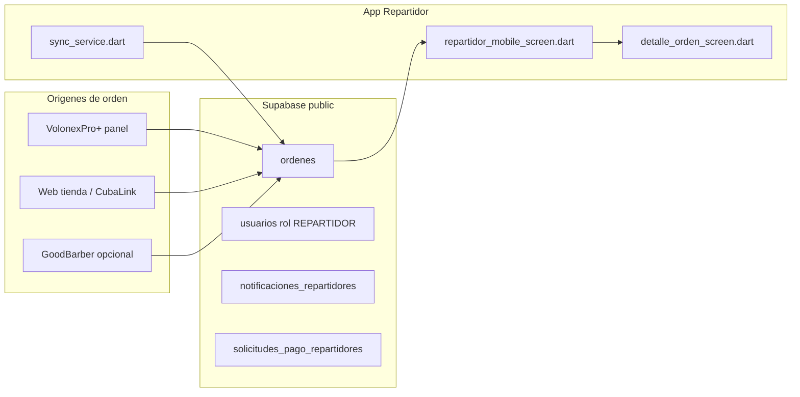

# Integración: órdenes compartidas (VolonexPro+ / tienda → Repartidor)

Este documento resume cómo la app **Repartidor VolonexPro+** consume la tabla `public.ordenes` en Supabase, alineada con el panel VolonexPro+ y las tiendas que insertan en la misma base.

## Ubicación del código

| Área | Archivo |
|------|---------|
| Lista, filtros, Realtime | `lib/screens/repartidor_mobile_screen.dart` (`_cargarOrdenes` ~622, `_suscribirseAOrdenesNuevas` ~1664) |
| Detalle y acciones de estado | `lib/screens/detalle_orden_screen.dart` |
| Modelo | `lib/models/orden.dart` (`Orden.fromJson` / `toJson`) |
| Offline / cola | `lib/services/sync_service.dart`, `lib/services/orden_cache_service.dart` |

## Diagrama de flujo

**Contrato:** todas las órdenes logísticas que debe ver el repartidor son filas en `public.ordenes` con el `tenant_id` de la empresa. No existe una API aparte para “pedidos web”: son las mismas filas que crea o actualiza VolonexPro+ cuando la tienda genera pedidos.

## Quién ve qué (resumen)

Implementación en `_cargarOrdenes` en `repartidor_mobile_screen.dart`:

| Rol | Filtro principal |
|-----|------------------|
| Repartidor normal | `tenant_id` + `repartidor_nombre` igual al **nombre** del usuario en sesión (y reglas adicionales de tipo de orden / sucursal / interruptores) |
| Master | `tenant_id` — ve las órdenes de envío del tenant (con exclusiones en código, p. ej. RECOGIDA según modo recolector) |
| Recolector | `tenant_id` + `tipo_orden = RECOGIDA` + `repartidor_nombre` |

**Tienda / web:** el repartidor normal **solo** verá esas órdenes cuando `repartidor_nombre` coincida exactamente con `usuarios.nombre` del driver, **o** cuando un usuario **master** las gestione desde la lista. Una orden nueva **sin** repartidor asignado **no** entra en la consulta del repartidor normal hasta la asignación.

## Tiempo real (Realtime)

`_suscribirseAOrdenesNuevas` escucha cambios en `ordenes` filtrados por `repartidor_nombre`.

- Si la orden se crea sin repartidor y luego se actualiza `repartidor_nombre`, el **UPDATE** puede disparar la suscripción cuando el nombre coincide.
- Un **INSERT** inicial sin `repartidor_nombre` correcto **no** notifica al canal del repartidor hasta que el nombre coincida.

## Pedidos con entrega por vendedor

En `orden.dart`, `entrega_por_vendedor` se mapea a `entregaPorVendedor`. También existen `vendedor_contacto_*` y `avisos_recogida_vendedor`. En detalle, parte de la UI condiciona acciones cuando **no** es entrega por vendedor (ver `detalle_orden_screen.dart`).

## Riesgos operativos

1. **Nombre exacto:** espacios o variantes en `repartidor_nombre` vs `usuarios.nombre` rompen el match y Realtime no compensa.
2. **`tenant_id` ausente** en el usuario: la app puede bloquear carga por seguridad; el repartidor no verá órdenes.
3. **Archivo grande:** `repartidor_mobile_screen.dart` concentra mucha lógica; conviene `flutter analyze` y pruebas manuales tras cambios.

## Pruebas manuales

Ver checklist ejecutable en `docs/QA_AUDITORIA_REPARTIDOR.md`.

## Tests automáticos

Hay pruebas mínimas de `Orden.fromJson` en `test/orden_from_json_test.dart` (campos vendedor, `tenant_id`, compatibilidad offline camelCase).
